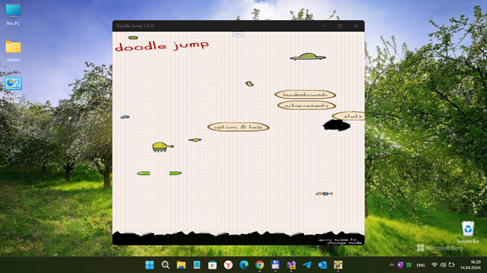

# DoodleJump 1.0.x (MonoGame2D sample)

url: https://github.com/mediaexplorer74/doodlejump
page_type: sample
description: "A sample app accompanying a tutorial that teaches you the basics of game development in MonoGame."
languages: csharp
products: windows 10, windows 10 mobile

## About 
This is only my anotter experiment to fast transform WP8 (XAP) to UWP (APPX) on/in W10M Astoria :)
 
Not for any production. This is for learning purpopes / dev only!

## Screenshot(s)

## Features
Min. Win. OS Build descreased to 10240 (Astoria Compatibility)

## Requirements
This app requires Visual Studio 2022 (Preview) Community to run. [Click here to learn how to get set up with Visual Studio](https://docs.microsoft.com/windows/uwp/get-started/get-set-up).

## Install and run the app
1. Install **MonoGame 3.6** for Visual Studio from [monogame.net](http://www.monogame.net/)
2. Clone or download this repository
3. Open **DoodleJump.sln** in Visual Studio.
4. To run the app, press **F5**. To quit, press **ESC**.

## Learn more about MonoGame UWP gamedev
For a step-by-step walkthrough of the code, check out the [MonoGame 2D tutorial on docs.microsoft.com](https://web.archive.org/web/20170907085024/https://docs.microsoft.com/en-us/windows/uwp/get-started/get-started-tutorial-game-mg2d).

## Status
- Game only starts "as is" (main menu with greeeat graphics distort.)))
- XBox Live deals brocken (disabled / cutted)
- Sensor deals + Game control not ready (cutted too!)
- Only PoP, no less no more! =))))

## ..
As is. No support. For Learning purposes only. DIY.

## .
[m][e] 2024
